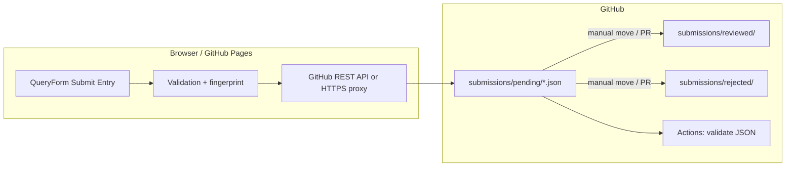

# GitHub submission workflow

This document describes how form submissions become JSON files in `submissions/pending/`, how reviews work, and how to configure GitHub Pages securely.

## Architecture

- **Static app** (Next.js `output: "export"`) runs entirely in the browser.
- **Submit** builds a `SubmissionRecord`, checks duplicates (session + optional repo listing / proxy check), then **creates a new file** under `submissions/pending/` via the [Contents API](https://docs.github.com/en/rest/repos/contents#create-or-update-file-contents).
- **Folders** are implicit in Git: committing `submissions/pending/file.json` creates the path. `.gitkeep` files keep empty folders in the repo.
- **GitHub Actions** validate JSON shape on every push/PR touching `submissions/**/*.json`.
- **Review** is manual: move or rename files between `pending/`, `reviewed/`, and `rejected/` (local git, GitHub UI, or PR). Optionally edit `status` inside the JSON to match the folder.

## Folder layout

| Path | Role |
|------|------|
| `submissions/pending/` | New submissions from the app |
| `submissions/reviewed/` | Approved entries |
| `submissions/rejected/` | Rejected entries |
| `submissions/examples/` | Example only (not validated by CI) |

## Where things live

| Concern | Location |
|---------|----------|
| Frontend submit + validation | `frontend/src/components/data/QueryForm.tsx`, `frontend/src/lib/githubSubmit.ts`, `frontend/src/lib/githubApi.ts`, `frontend/src/lib/githubConfig.ts`, `frontend/src/lib/submissionValidate.ts`, `frontend/src/lib/buildSubmissionRecord.ts` |
| Types | `frontend/src/types/submission.ts` |
| GitHub Actions | `.github/workflows/validate-submissions.yml` |
| Validation script | `scripts/validate-submissions.mjs` |
| Optional secure proxy (recommended) | `proxy/cloudflare-worker.js`, `proxy/wrangler.toml.example` |
| Env template | `frontend/.env.example` |
| Example JSON | `submissions/examples/example-submission.json` |

## Security and tokens

| Approach | Where the secret lives | Notes |
|----------|------------------------|--------|
| **Direct PAT** | `NEXT_PUBLIC_GITHUB_TOKEN` in `.env.local` / CI env for build | The value is **bundled into client JS**. Anyone can extract it from the site. Only acceptable for trusted, internal deployments; use a **fine-grained PAT** scoped to **one repo** with **Contents: Read and write** only; rotate regularly. |
| **Proxy (recommended)** | `GITHUB_TOKEN` as a **Cloudflare Worker secret** (or other edge) | Browser only knows `NEXT_PUBLIC_GITHUB_SUBMIT_PROXY`. The worker checks `Origin` against `ALLOWED_ORIGINS`, optionally deduplicates, then calls GitHub. |
| **CI-only** | `secrets.GITHUB_TOKEN` in Actions | Used by workflows in this repo; **cannot** be called from the static site for arbitrary user commits without additional setup. |

There is **no way** to keep a true secret in a pure static GitHub Pages bundle. Production setups should use the **proxy** pattern or accept PAT exposure risk with tight scoping and rotation.

## Step-by-step setup

1. **Create folders** (already in repo): `submissions/pending`, `reviewed`, `rejected`.
2. **Choose auth**: proxy (recommended) or direct PAT.
3. **Proxy path**: Deploy `proxy/cloudflare-worker.js` with Wrangler; set `GITHUB_TOKEN` secret and `ALLOWED_ORIGINS` to your GitHub Pages origin (and `http://localhost:3000` for dev). Copy the worker URL into `NEXT_PUBLIC_GITHUB_SUBMIT_PROXY`.
4. **Direct PAT path**: Create a fine-grained PAT; set `NEXT_PUBLIC_GITHUB_TOKEN` (development: `frontend/.env.local`).
5. **Set repo vars** in `frontend/.env.local` or CI: `NEXT_PUBLIC_GITHUB_OWNER`, `NEXT_PUBLIC_GITHUB_REPO`, `NEXT_PUBLIC_GITHUB_BRANCH` (usually `main`).
6. **Build** the frontend (`npm run build` in `frontend`). For Pages, run `npm run build:pages` so `docs/` receives the static export.
7. **Push** to GitHub; enable Actions for validation.
8. **Test** Submit Entry: confirm a new JSON appears under `submissions/pending/` on the default branch.

## GitHub Pages deployment

This project copies the static export to `/docs` via `frontend/scripts/publish-docs.mjs` (`npm run build:pages`).

1. In the GitHub repo: **Settings → Pages → Build and deployment → GitHub Actions** (or deploy from `docs/` on a branch, depending on your existing setup).
2. Ensure workflow or build injects the same `NEXT_PUBLIC_*` variables used at build time (remember: **do not** inject a PAT into public builds unless you accept the risk).
3. `basePath` in `next.config.js` uses `NEXT_PUBLIC_REPO_NAME` or `GITHUB_REPOSITORY` for asset paths under `/<repo>/`.

For production, prefer **proxy** so secrets are not in the Pages artifact.

## Review / reject flow (practical)

1. Open the repo on GitHub (or clone locally).
2. List `submissions/pending/` JSON files.
3. **Approve**: Move file to `submissions/reviewed/` (GitHub UI: edit path in a commit, or `git mv`). Optionally set `"status": "reviewed"` in the JSON.
4. **Reject**: Move to `submissions/rejected/` and optionally set `"status": "rejected"`.
5. Open a PR if you want CI validation before merging moves.

The app always **creates** pending files with `"status": "pending"`. Moving folders is **outside** the SPA by design.

## Duplicate prevention

- **Canonical hash** of the submission body (excluding ids and timestamps) → **32-hex prefix** embedded in the filename.
- **Session**: same browser session cannot resubmit identical content.
- **Direct PAT**: lists `submissions/pending` via API before upload.
- **Proxy**: worker lists `pendingPrefix` before PUT and returns **409** if a matching fingerprint exists.

## Example JSON

See `submissions/examples/example-submission.json`.
